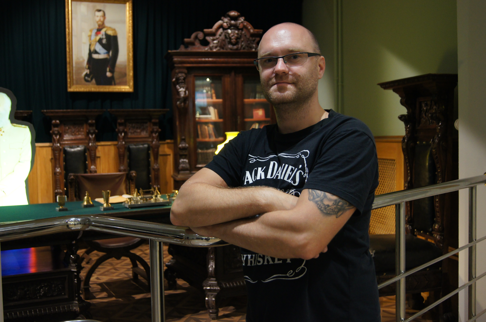

# ОБО МНЕ

### Приветствую!
### Меня зовут Александр Владимирович Захаров. 

- Я начинающий программист с опытом в автоматизации тестирования.

- В текущий момент работаю _системным инженером_ в компании **ПочтаТех**.
- Ранее много лет посвятил работе **Тестировщиком ПО**. В процессе работы в тестировании смог научиться использовать автоматизацию тестирования при помощи языка программирования **Java** и библиотеки **Selenium**.

Познакомился с языком программирования **Python** на курсе по _автоматизации тестирования REST API_ и понял, что хочу изучать разработку на нем.
